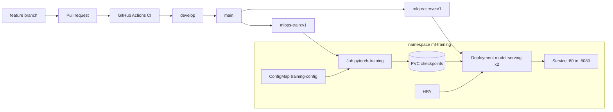

# mlops-pytorch-pipeline

PyTorch image classifier taken through local development, Docker, and
Kubernetes. Course: MLOps and Infrastructure for Machine Learning.
Roll number: DA25G524.

The model is a ResNet-18 trained on CIFAR-10. Training runs as a
Kubernetes Job that writes a checkpoint to a PersistentVolumeClaim. A
Deployment of two FastAPI replicas mounts that claim read-only and
serves `POST /predict` behind a ClusterIP service.

## Architecture



## Repository layout

```
configs/training_config.yaml   hyperparameters
docker/                        training and serving Dockerfiles
k8s/                           Job, Deployment, Service, HPA
requirements/train.txt         pinned training dependencies
requirements/serve.txt         pinned inference dependencies
src/                           model, dataset, train, serve
tests/                         unit tests
.github/workflows/ci.yml       lint and pytest
```

## Local setup

```bash
python3 -m venv .venv
source .venv/bin/activate
pip install -r requirements/train.txt -r requirements/serve.txt
pip install pytest ruff httpx
ruff check src tests
pytest
```

A short training run (downloads CIFAR-10 into `data/`):

```bash
TRAIN_EPOCHS=1 TRAIN_SUBSET_FRACTION=0.05 python src/train.py
```

Metrics are one JSON object per line on stdout. The checkpoint is
written to `checkpoints/classifier_v1.pt`. Serve it with:

```bash
python src/serve.py
```

In another terminal:

```bash
curl http://localhost:8080/health
```

`POST /predict` needs an image file. Docker and Kubernetes steps land
in later pull requests.

## Git workflow

Work happens on feature branches off `develop`. Each part of the
assignment is one pull request. Commit messages follow Conventional
Commits (`feat:`, `fix:`, `chore:`, `docs:`, `test:`, `ci:`).
