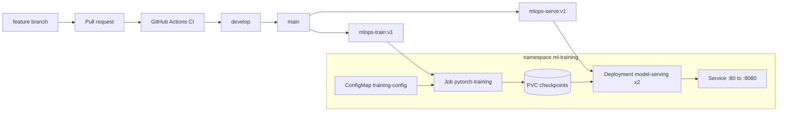

# mlops-pytorch-pipeline

PyTorch image classifier taken through local development, Docker, and
Kubernetes. Course: MLOps and Infrastructure for Machine Learning.
Roll number: DA25G524.

The model is a ResNet-18 trained on CIFAR-10. Training runs as a
Kubernetes Job that writes a checkpoint to a PersistentVolumeClaim. A
Deployment of two FastAPI replicas mounts that claim read-only and
serves `POST /predict` behind a ClusterIP service.

## Architecture



## Repository layout

```
configs/training_config.yaml   hyperparameters
docker/                        training and serving Dockerfiles
k8s/                           Job, Deployment, Service, PVC
requirements/train.txt         pinned training dependencies
requirements/serve.txt         pinned inference dependencies
src/                           model, dataset, train, serve
tests/                         unit tests
.github/workflows/ci.yml       lint and pytest
```

## Local setup

```bash
python3 -m venv .venv
source .venv/bin/activate
pip install -r requirements/train.txt -r requirements/serve.txt
pip install pytest ruff httpx
ruff check src tests
pytest
```

A short training run (downloads CIFAR-10 into `data/`):

```bash
TRAIN_EPOCHS=1 TRAIN_SUBSET_FRACTION=0.05 python src/train.py
```

Metrics are one JSON object per line on stdout. The checkpoint is
written to `checkpoints/classifier_v1.pt`. Serve it with:

```bash
python src/serve.py
```

In another terminal:

```bash
curl http://localhost:8080/health
```

`POST /predict` needs an image file:

```bash
python scripts/make_test_image.py
curl -X POST http://localhost:8080/predict \
  -F "image=@test_image.png"
```

## Docker

Images are CPU-only so they build on a laptop. Start Rancher Desktop
or Docker Desktop first.

```bash
docker build -f docker/Dockerfile.train -t mlops-train:v1 .
docker build -f docker/Dockerfile.serve -t mlops-serve:v1 .
```

A short training run inside the container. Data and checkpoints live
on the host via mounts. `TRAIN_EPOCHS` and `TRAIN_SUBSET_FRACTION`
override the YAML without a rebuild:

```bash
mkdir -p data checkpoints
docker run --rm \
  -e TRAIN_EPOCHS=1 \
  -e TRAIN_SUBSET_FRACTION=0.05 \
  -v "$(pwd)/data:/app/data" \
  -v "$(pwd)/checkpoints:/app/checkpoints" \
  mlops-train:v1
```

Serve the checkpoint (wait until HEALTHCHECK reports healthy):

```bash
python scripts/make_test_image.py
docker run --rm -p 8080:8080 \
  -v "$(pwd)/checkpoints:/app/checkpoints" \
  mlops-serve:v1
```

In another terminal:

```bash
curl http://localhost:8080/health
curl -X POST http://localhost:8080/predict \
  -F "image=@test_image.png"
docker ps --format "table {{.Names}}\t{{.Status}}"
```

## Kubernetes

Tested on Rancher Desktop k3s. Give the VM at least 4 CPUs and 8 GB
of memory so the training job (2 CPU / 4 Gi) can schedule.
`imagePullPolicy: Never` means the images must already exist locally.
Do not apply `training-job-gpu.yaml` on a laptop; it needs a GPU node.
HPA is omitted (course staff said it is not required).

```bash
kubectl config use-context rancher-desktop
kubectl apply -f k8s/namespace.yaml
kubectl apply -f k8s/configmap.yaml
kubectl apply -f k8s/pvc.yaml
kubectl get pvc -n ml-training
```

CIFAR-10 cannot be downloaded inside the cluster (TLS to Toronto
fails on this network). Copy the files you already have into the PVC:

```bash
kubectl apply -f k8s/data-loader.yaml
kubectl wait --for=condition=Ready pod/data-loader \
  -n ml-training --timeout=60s
kubectl cp data/cifar-10-batches-py \
  ml-training/data-loader:/data/cifar-10-batches-py
kubectl delete pod data-loader -n ml-training
```

Train, then serve:

```bash
kubectl apply -f k8s/training-job.yaml
kubectl get pods -n ml-training
kubectl logs -f job/pytorch-training -n ml-training
kubectl wait --for=condition=complete job/pytorch-training \
  -n ml-training --timeout=45m

kubectl apply -f k8s/serving-deployment.yaml
kubectl apply -f k8s/serving-service.yaml
kubectl get pods -n ml-training
kubectl describe deployment model-serving -n ml-training
```

Predict through the service:

```bash
kubectl port-forward svc/model-serving 8080:80 -n ml-training
```

In another terminal:

```bash
curl http://localhost:8080/health
curl -X POST http://localhost:8080/predict \
  -F "image=@test_image.png"
```

Tear down with `kubectl delete namespace ml-training`.

## Git workflow

Work happens on feature branches off `develop`. Each part of the
assignment is one pull request. Commit messages follow Conventional
Commits (`feat:`, `fix:`, `chore:`, `docs:`, `test:`, `ci:`).
